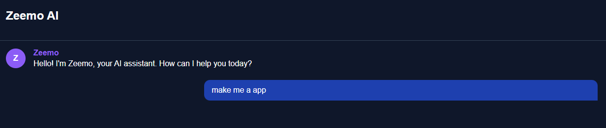

# Zeemo AI Chatbot 🤖

A modern, dark-themed AI chatbot with secure OpenAI integration.



## Features ✨
- **Secure API Proxy** – OpenAI key never exposed client-side
- **Sleek Dark UI** – Easy-on-the-eyes design with purple accents
- **Real-time Responses** – Typing indicators and smooth chat flow
- **Modern Animations** – Subtle hover effects and transitions
- **Mobile-Friendly** – Responsive layout for all devices

## Tech Stack 🛠️
- **Frontend**: HTML5, CSS3, JavaScript
- **Backend**: Vercel Serverless Functions (Node.js)
- **API**: OpenAI GPT-3.5/4

## Deployment Guide 🚀

### 1. Vercel Setup
```bash
# Install Vercel CLI (if needed)
npm install -g vercel

# Deployed under
vercel